# 大贺运输新系统 - 数据库ER图

```mermaid
erDiagram
    %% 合作伙伴相关表
    partner_companies {
        varchar company_id PK "公司ID"
        varchar company_name "公司名称"
        varchar company_phone "联系电话"
        boolean system_use "系统使用"
        varchar instruction_text "指示文"
        varchar status "状态"
        text memo "备注"
        timestamp created_at "创建时间"
        timestamp updated_at "更新时间"
    }

    partner_company_codes {
        bigint id PK "主键"
        varchar code_id "代码ID"
        varchar company_id FK "所属公司"
        varchar code_type "代码类型"
        varchar code_value "代码值"
        int display_order "显示顺序"
        boolean is_active "是否激活"
    }

    r_partner_base {
        bigint id PK "主键"
        varchar partner_id FK "合作伙伴ID"
        varchar base_id FK "基地ID"
        boolean is_active "是否激活"
        timestamp created_at "创建时间"
    }

    %% 用户与权限表
    m_user {
        bigint id PK "主键"
        varchar user_id UK "用户ID"
        varchar user_name "用户名"
        varchar email UK "邮箱"
        varchar password_hash "密码哈希"
        varchar partner_id FK "所属合作伙伴"
        varchar role "角色"
        boolean is_active "是否激活"
        timestamp last_login_at "最后登录时间"
        timestamp created_at "创建时间"
        timestamp updated_at "更新时间"
    }

    base_accounts {
        bigint id PK "主键"
        varchar user_id UK "用户ID"
        varchar user_name "用户名"
        varchar email UK "邮箱"
        varchar affiliation "所属"
        varchar permission "权限"
        varchar account_status "账户状态"
        varchar azure_ad_id "AzureAD ID"
        text[] roles "角色列表"
        text[] permissions "权限列表"
        timestamp last_login_at "最后登录"
        timestamp created_at "创建时间"
        timestamp updated_at "更新时间"
    }

    m_screen {
        bigint id PK "主键"
        varchar screen_id UK "画面ID"
        varchar screen_name "画面名称"
        varchar category "分类"
        varchar route_path "路由路径"
        boolean device_pc "PC对应"
        boolean device_sp "SP对应"
        int sort_order "排序"
        boolean is_active "是否激活"
        timestamp created_at "创建时间"
    }

    m_permission {
        bigint id PK "主键"
        varchar role_id "角色ID"
        varchar screen_id FK "画面ID"
        int access_level "访问级别"
        boolean can_read "可读"
        boolean can_write "可写"
        boolean can_delete "可删"
        boolean is_active "是否激活"
        timestamp created_at "创建时间"
    }

    %% 基地表
    base_list {
        bigint id PK "主键"
        varchar base_id UK "基地ID"
        varchar base_name "基地名称"
        varchar base_type "基地类型"
        text address "地址"
        varchar phone "电话"
        boolean is_active "是否激活"
        int sort_order "排序"
        timestamp created_at "创建时间"
        timestamp updated_at "更新时间"
    }

    %% 订单相关表
    orders {
        bigint id PK "主键"
        varchar order_id UK "订单ID"
        varchar company_id FK "公司ID"
        varchar order_year_month "订单年月"
        varchar status "状态"
        text request_detail "请求详情"
        date request_date "请求日"
        date deadline "期限日"
        text partner_memo "合作伙伴备注"
        timestamp sent_at "发送时间"
        timestamp accepted_at "接受时间"
        timestamp rejected_at "拒绝时间"
        text rejected_reason "拒绝理由"
        int version "版本号"
        timestamp created_at "创建时间"
        timestamp updated_at "更新时间"
    }

    order_details {
        bigint id PK "主键"
        varchar detail_id UK "明细ID"
        varchar order_id FK "订单ID"
        varchar line_code "线路代码"
        varchar line_name "线路名称"
        varchar work_type "工作类型"
        varchar cargo_type "货物类型"
        decimal weight "重量(kg)"
        decimal volume "体积(m³)"
        text pickup_address "提货地址"
        text delivery_address "送货地址"
        timestamp scheduled_pickup "计划提货时间"
        timestamp scheduled_delivery "计划送货时间"
        decimal unit_price "单价"
        int quantity "数量"
        decimal amount "金额"
        text remark "备注"
    }

    %% 实绩与费用表
    completed_orders {
        bigint id PK "主键"
        varchar completed_order_id UK "实绩ID"
        varchar order_id FK "关联订单ID"
        varchar company_id FK "公司ID"
        varchar completed_order_year_month "实绩年月"
        decimal total_amount "合计金额"
        varchar status "状态"
        timestamp confirmed_at "确认时间"
        timestamp sent_at "发送时间"
        timestamp accepted_at "接受时间"
        int version "版本号"
        timestamp created_at "创建时间"
        timestamp updated_at "更新时间"
    }

    daily_rates {
        bigint id PK "主键"
        varchar rate_id UK "费用ID"
        varchar completed_order_id FK "实绩ID"
        varchar line_code "线路代码"
        varchar line_name "线路名称"
        int version "版本号"
        decimal amount_monday "周一"
        decimal amount_tuesday "周二"
        decimal amount_wednesday "周三"
        decimal amount_thursday "周四"
        decimal amount_friday "周五"
        decimal amount_saturday "周六"
        decimal amount_sunday "周日"
        varchar status "状态"
        text rejection_reason "拒绝理由"
        boolean change_flag "变更标志"
        timestamp created_at "创建时间"
        timestamp updated_at "更新时间"
    }

    %% 账单相关表
    billings {
        bigint id PK "主键"
        varchar billing_id UK "账单ID"
        varchar billing_year_month "账单年月"
        varchar company_id FK "公司ID"
        decimal amount "金额"
        varchar status "状态"
        date issue_date "发布日"
        date due_date "到期日"
        date paid_date "支付日"
        text remark "备注"
        timestamp created_at "创建时间"
        timestamp updated_at "更新时间"
    }

    billing_details {
        bigint id PK "主键"
        varchar detail_id UK "明细ID"
        varchar billing_id FK "账单ID"
        varchar completed_order_id FK "实绩ID"
        varchar description "说明"
        decimal amount "金额"
        decimal tax_rate "税率"
        decimal tax_amount "税额"
        timestamp created_at "创建时间"
    }

    %% 上传相关表
    upload_history {
        bigint id PK "主键"
        varchar upload_id UK "上传ID"
        varchar company_id FK "公司ID"
        varchar file_name "文件名"
        varchar file_type "文件类型"
        varchar upload_mode "上传模式"
        varchar error_handling "错误处理"
        varchar status "状态"
        int record_count "记录数"
        int success_count "成功数"
        int failed_count "失败数"
        varchar uploaded_by "上传人"
        timestamp uploaded_at "上传时间"
        timestamp processed_at "处理完成时间"
        int processing_time "处理时间(秒)"
    }

    upload_error_details {
        bigint id PK "主键"
        varchar error_id UK "错误ID"
        varchar upload_id FK "上传ID"
        int row_number "行号"
        varchar column_name "列名"
        varchar error_type "错误类型"
        text error_message "错误信息"
        text original_value "原始值"
    }

    %% 审计日志表
    action_history {
        bigint id PK "主键"
        varchar action_id UK "操作ID"
        varchar action_type "操作类型"
        varchar action_name "操作名称"
        varchar module_type "模块类型"
        varchar related_id "关联ID"
        jsonb before_value "修改前值"
        jsonb after_value "修改后值"
        varchar ip_address "IP地址"
        text user_agent "用户代理"
        varchar performed_by "操作人"
        timestamp performed_at "操作时间"
    }

    partner_audit_log {
        bigint id PK "主键"
        varchar log_id UK "日志ID"
        varchar company_id FK "公司ID"
        varchar action_type "操作类型"
        jsonb before_value "修改前值"
        jsonb after_value "修改后值"
        varchar performed_by "操作人"
        timestamp performed_at "操作时间"
    }

    base_account_audit_log {
        bigint id PK "主键"
        varchar log_id UK "日志ID"
        varchar user_id FK "用户ID"
        varchar action_type "操作类型"
        jsonb before_value "修改前值"
        jsonb after_value "修改后值"
        varchar ip_address "IP地址"
        varchar performed_by "操作人"
        timestamp performed_at "操作时间"
    }

    %% 消息表
    messages {
        bigint id PK "主键"
        varchar message_id UK "消息ID"
        varchar related_type "关联类型"
        varchar related_id "关联ID"
        text content "消息内容"
        varchar sender_id "发送者ID"
        varchar sender_name "发送者名称"
        varchar sender_type "发送者类型"
        varchar recipient_id "接收者ID"
        boolean is_read "已读标志"
        timestamp created_at "创建时间"
    }

    %% 請求書文件表
    t_invoice_file {
        bigint id PK "主键"
        varchar invoice_id UK "請求書ID"
        varchar partner_id FK "合作伙伴ID"
        varchar base_id FK "基地ID"
        varchar company_code "公司代码"
        varchar file_name "文件名"
        varchar file_path "文件路径"
        bigint file_size "文件大小"
        varchar target_month "対象月"
        varchar status "状态"
        varchar last_action "最后操作"
        varchar uploaded_by "上传人"
        timestamp uploaded_at "上传时间"
        varchar updated_by "更新人"
        timestamp updated_at "更新时间"
        timestamp deleted_at "删除时间"
    }

    t_invoice_send_log {
        bigint id PK "主键"
        varchar log_id UK "日志ID"
        varchar invoice_id FK "請求書ID"
        varchar base_id FK "基地ID"
        varchar partner_id FK "合作伙伴ID"
        timestamp sent_at "发送时间"
        varchar sent_by "发送者"
        varchar status "发送状态"
        boolean notification_sent "通知发送"
        text remarks "备注"
        timestamp created_at "创建时间"
    }

    %% 关系定义
    partner_companies ||--o{ partner_company_codes : "公司代码"
    partner_companies ||--o{ m_user : "用户"
    partner_companies ||--o{ orders : "订单"
    partner_companies ||--o{ completed_orders : "实绩"
    partner_companies ||--o{ billings : "账单"
    partner_companies ||--o{ upload_history : "上传历史"
    partner_companies ||--o{ r_partner_base : "基地关联"
    partner_companies ||--o{ t_invoice_file : "請求書"
    partner_companies ||--o{ partner_audit_log : "审计日志"

    partner_company_codes }o--|| partner_companies : "company_id"

    m_screen ||--o{ m_permission : "权限"

    base_list ||--o{ r_partner_base : "合作伙伴关联"
    base_list ||--o{ t_invoice_file : "請求書"
    base_list ||--o{ t_invoice_send_log : "发送日志"

    orders ||--o{ order_details : "订单明细"
    orders ||--o{ completed_orders : "实绩"

    completed_orders ||--o{ daily_rates : "日别费用"
    completed_orders ||--o{ billing_details : "账单明细"

    billings ||--o{ billing_details : "账单明细"

    upload_history ||--o{ upload_error_details : "错误详情"

    base_accounts ||--o{ base_account_audit_log : "审计日志"
```

## 表分类说明

| 分类 | 表名 | 说明 |
|------|------|------|
| **合作伙伴** | partner_companies, partner_company_codes, r_partner_base | 合作伙伴公司信息管理 |
| **用户权限** | m_user, base_accounts, m_screen, m_permission | 用户认证与权限控制 |
| **基地管理** | base_list | 基地信息管理 |
| **订单管理** | orders, order_details | 订单主表与明细 |
| **实绩费用** | completed_orders, daily_rates | 实绩与日别傭车费 |
| **账单管理** | billings, billing_details | 账单主表与明细 |
| **文件上传** | upload_history, upload_error_details | CSV上传历史与错误 |
| **审计日志** | action_history, partner_audit_log, base_account_audit_log | 操作历史记录 |
| **消息通知** | messages | 消息表 |
| **請求書** | t_invoice_file, t_invoice_send_log | 請求書文件与发送日志 |

---

*文档版本: 1.0*
*更新时间: 2026-02-10*
