# 大贺运输新系统数据库ER图

## 实体关系图 (Entity Relationship Diagram)

```mermaid
erDiagram
    %% 共通模块
    m_screen {
        BIGSERIAL id PK "画面ID"
        VARCHAR(20) screen_id UK "画面编号"
        VARCHAR(100) screen_name "画面名称"
        VARCHAR(50) category "分类"
        TEXT description "说明"
        VARCHAR(100) route_path "路由路径"
        BOOLEAN device_pc "PC对应"
        BOOLEAN device_sp "手机对应"
        INTEGER sort_order "排序"
        BOOLEAN is_active "有效状态"
        TIMESTAMP created_at "创建时间"
        VARCHAR(50) created_by "创建者"
        TIMESTAMP updated_at "更新时间"
        VARCHAR(50) updated_by "更新者"
    }

    m_role {
        BIGSERIAL id PK "角色ID"
        VARCHAR(20) role_id UK "角色编号"
        VARCHAR(50) role_name "角色名称"
        VARCHAR(50) role_name_ja "日文角色名"
        VARCHAR(200) description "说明"
        BOOLEAN is_active "有效状态"
        TIMESTAMP created_at "创建时间"
    }

    m_permission {
        BIGSERIAL id PK "权限ID"
        VARCHAR(20) role_id FK "角色编号"
        VARCHAR(20) screen_id FK "画面编号"
        INTEGER access_level "访问级别"
        BOOLEAN can_read "可读"
        BOOLEAN can_write "可写"
        BOOLEAN can_delete "可删除"
        BOOLEAN is_active "有效状态"
        TIMESTAMP created_at "创建时间"
    }

    %% 伙伴模块
    partner_companies {
        BIGSERIAL id PK "伙伴公司ID"
        VARCHAR(50) company_id UK "公司编号"
        VARCHAR(200) company_name "公司名称"
        VARCHAR(20) company_phone "公司电话"
        BOOLEAN system_use "系统使用"
        VARCHAR(20) instruction_text "指示书显示文字"
        VARCHAR(20) status "状态"
        TEXT memo "备注"
        TIMESTAMP created_at "创建时间"
        VARCHAR(100) created_by "创建者"
        TIMESTAMP updated_at "更新时间"
        VARCHAR(100) updated_by "更新者"
    }

    partner_company_codes {
        BIGSERIAL id PK "公司代码ID"
        VARCHAR(50) company_id FK "公司编号"
        VARCHAR(50) company_code "公司代码"
        BOOLEAN is_primary "主代码"
        DATE effective_date "生效日期"
        DATE expiration_date "失效日期"
        BOOLEAN is_active "有效状态"
        TIMESTAMP created_at "创建时间"
    }

    partner_users {
        BIGSERIAL id PK "伙伴用户ID"
        VARCHAR(50) user_id UK "用户编号"
        VARCHAR(50) company_id FK "所属公司编号"
        VARCHAR(200) email "邮箱地址"
        VARCHAR(20) personal_sms "个人电话"
        VARCHAR(10) notification_target "通知目标"
        VARCHAR(10) account_type "账户类型"
        VARCHAR(10) sub_account_notification "子账户通知"
        VARCHAR(200) branch_name "支店营业所名"
        VARCHAR(20) account_status "账户状态"
        VARCHAR(255) password_hash "密码哈希"
        TIMESTAMP last_login_at "最后登录时间"
        TIMESTAMP created_at "创建时间"
        TIMESTAMP updated_at "更新时间"
    }

    partner_audit_log {
        BIGSERIAL id PK "伙伴审计日志ID"
        VARCHAR(50) company_id FK "公司编号"
        VARCHAR(50) user_id "用户编号"
        VARCHAR(50) action_type "操作类型"
        TEXT action_detail "操作详情"
        TEXT before_value "变更前值"
        TEXT after_value "变更后值"
        VARCHAR(45) ip_address "IP地址"
        TEXT user_agent "用户代理"
        VARCHAR(100) performed_by "执行者"
        TIMESTAMP performed_at "执行时间"
    }

    %% 基础账户模块
    base_accounts {
        BIGSERIAL id PK "基础账户ID"
        VARCHAR(50) user_id UK "用户编号"
        VARCHAR(200) user_name "用户姓名"
        VARCHAR(200) email "邮箱地址"
        VARCHAR(200) affiliation "所属"
        VARCHAR(20) permission "权限"
        VARCHAR(20) account_status "账户状态"
        VARCHAR(100) azure_ad_id "Azure AD ID"
        TEXT[] roles "角色列表"
        TEXT[] permissions "权限列表"
        TIMESTAMP last_login_at "最后登录时间"
        TIMESTAMP created_at "创建时间"
        VARCHAR(100) created_by "创建者"
        TIMESTAMP updated_at "更新时间"
        VARCHAR(100) updated_by "更新者"
    }

    base_list {
        BIGSERIAL id PK "基础列表ID"
        VARCHAR(50) base_id UK "基础编号"
        VARCHAR(200) base_name "基础名称"
        VARCHAR(20) base_type "基础类型"
        TEXT address "地址"
        VARCHAR(20) phone "电话"
        BOOLEAN is_active "有效状态"
        INTEGER sort_order "排序"
        TIMESTAMP created_at "创建时间"
        TIMESTAMP updated_at "更新时间"
    }

    base_account_audit_log {
        BIGSERIAL id PK "基础账户审计日志ID"
        VARCHAR(50) user_id FK "用户编号"
        VARCHAR(50) changed_field "变更字段"
        TEXT before_value "变更前值"
        TEXT after_value "变更后值"
        TEXT change_reason "变更理由"
        VARCHAR(100) performed_by "执行者"
        TIMESTAMP performed_at "执行时间"
    }

    %% 发注模块
    orders {
        BIGSERIAL id PK "发注ID"
        VARCHAR(50) order_id UK "发注编号"
        VARCHAR(50) company_id FK "公司编号"
        VARCHAR(7) order_year_month "发注年月"
        VARCHAR(20) status "发注状态"
        TEXT request_detail "请求详情"
        DATE request_date "请求日期"
        DATE deadline "截止日期"
        TEXT partner_memo "伙伴备注"
        TIMESTAMP sent_at "发送时间"
        TIMESTAMP accepted_at "受理时间"
        TIMESTAMP rejected_at "拒绝时间"
        TEXT rejected_reason "拒绝理由"
        INTEGER version "版本"
        TIMESTAMP created_at "创建时间"
        VARCHAR(100) created_by "创建者"
        TIMESTAMP updated_at "更新时间"
        VARCHAR(100) updated_by "更新者"
    }

    order_details {
        BIGSERIAL id PK "发注明细ID"
        VARCHAR(50) detail_id UK "明细编号"
        VARCHAR(50) order_id FK "发注编号"
        VARCHAR(20) branch_code "支点代码"
        VARCHAR(100) branch_name "支点营业所名"
        VARCHAR(20) line_code "线路代码"
        VARCHAR(100) line_name "线路名称"
        VARCHAR(50) route_type "线路类型"
        VARCHAR(200) warehouse_location "入库地点"
        TIME warehouse_time "入库时间"
        VARCHAR(100) vehicle_type "使用车辆"
        VARCHAR(20) status "批准状态"
        TIMESTAMP created_at "创建时间"
        TIMESTAMP updated_at "更新时间"
    }

    order_schedules {
        BIGSERIAL id PK "发注日程ID"
        VARCHAR(50) schedule_id UK "日程编号"
        VARCHAR(50) order_id FK "发注编号"
        VARCHAR(50) detail_id "发注明细编号"
        INTEGER version "版本"
        DATE schedule_date "日程日期"
        BOOLEAN morning_flag "上午发"
        BOOLEAN afternoon_flag "到达"
        BOOLEAN week_monday "周一"
        BOOLEAN week_tuesday "周二"
        BOOLEAN week_wednesday "周三"
        BOOLEAN week_thursday "周四"
        BOOLEAN week_friday "周五"
        BOOLEAN week_saturday "周六"
        BOOLEAN week_sunday "周日"
        BOOLEAN is_holiday "假日"
        BOOLEAN change_flag "变更"
        TEXT change_detail "变更内容"
        TIMESTAMP created_at "创建时间"
        TIMESTAMP updated_at "更新时间"
    }

    %% 业绩模块 (已从performances改为completed_orders)
    completed_orders {
        BIGSERIAL id PK "业绩ID"
        VARCHAR(50) completed_order_id UK "业绩编号"
        VARCHAR(50) order_id FK "关联发注编号"
        VARCHAR(50) company_id FK "公司编号"
        VARCHAR(7) completed_order_year_month "业绩年月"
        DECIMAL(12，2) total_amount "合计金额"
        VARCHAR(20) status "状态"
        TIMESTAMP confirmed_at "确定时间"
        TIMESTAMP sent_at "发送时间"
        TIMESTAMP accepted_at "受理时间"
        INTEGER version "版本"
        TIMESTAMP created_at "创建时间"
        VARCHAR(100) created_by "创建者"
        TIMESTAMP updated_at "更新时间"
        VARCHAR(100) updated_by "更新者"
    }

    daily_rates {
        BIGSERIAL id PK "日别佣车费ID"
        VARCHAR(50) rate_id UK "费用编号"
        VARCHAR(50) completed_order_id FK "业绩编号"
        VARCHAR(20) line_code "线路代码"
        VARCHAR(100) line_name "线路名称"
        INTEGER version "版本"
        DECIMAL(10，2) amount_monday "周一金额"
        DECIMAL(10，2) amount_tuesday "周二金额"
        DECIMAL(10，2) amount_wednesday "周三金额"
        DECIMAL(10，2) amount_thursday "周四金额"
        DECIMAL(10，2) amount_friday "周五金额"
        DECIMAL(10，2) amount_saturday "周六金额"
        DECIMAL(10，2) amount_sunday "周日金额"
        VARCHAR(20) status "批准状态"
        TEXT rejection_reason "退回理由"
        BOOLEAN change_flag "变更"
        TIMESTAMP created_at "创建时间"
        TIMESTAMP updated_at "更新时间"
    }

    %% 请求模块
    billings {
        BIGSERIAL id PK "请求ID"
        VARCHAR(50) billing_id UK "请求编号"
        VARCHAR(7) billing_year_month "请求年月"
        VARCHAR(50) company_id FK "公司编号"
        DECIMAL(12，2) amount "请求金额"
        VARCHAR(20) status "请求状态"
        DATE issue_date "发行日期"
        DATE due_date "支付期限"
        DATE paid_date "支付日期"
        VARCHAR(200) base_name "基础名称"
        TEXT memo "备注"
        TIMESTAMP created_at "创建时间"
        VARCHAR(100) created_by "创建者"
        TIMESTAMP updated_at "更新时间"
        VARCHAR(100) updated_by "更新者"
    }

    billing_details {
        BIGSERIAL id PK "请求明细ID"
        VARCHAR(50) detail_id UK "明细编号"
        VARCHAR(50) billing_id FK "请求编号"
        VARCHAR(20) line_code "线路代码"
        VARCHAR(100) line_name "线路名称"
        DECIMAL(10，2) daily_rate "日别佣车费"
        INTEGER days "天数"
        DECIMAL(10，2) amount "金额"
        TEXT description "说明"
        INTEGER sort_order "排序"
        TIMESTAMP created_at "创建时间"
        TIMESTAMP updated_at "更新时间"
    }

    %% 文件上传模块
    upload_history {
        BIGSERIAL id PK "上传历史ID"
        VARCHAR(50) upload_id UK "上传编号"
        VARCHAR(50) company_id FK "公司编号"
        VARCHAR(255) file_name "文件名"
        VARCHAR(20) file_type "文件类型"
        BIGINT file_size "文件大小"
        VARCHAR(20) upload_mode "上传模式"
        VARCHAR(20) error_handling "错误处理"
        VARCHAR(20) status "处理状态"
        INTEGER record_count "总记录数"
        INTEGER success_count "成功件数"
        INTEGER failed_count "失败件数"
        TEXT error_message "错误信息"
        TEXT memo "备注"
        VARCHAR(100) uploaded_by "上传者"
        TIMESTAMP uploaded_at "上传时间"
        TIMESTAMP processed_at "处理完成时间"
        INTEGER processing_time "处理时间"
    }

    upload_error_details {
        BIGSERIAL id PK "上传错误明细ID"
        VARCHAR(50) error_id UK "错误编号"
        VARCHAR(50) upload_id FK "上传编号"
        INTEGER row_number "错误行号"
        VARCHAR(100) column_name "错误列名"
        VARCHAR(50) error_type "错误类型"
        TEXT error_message "错误内容"
        TEXT original_value "原值"
        TIMESTAMP created_at "创建时间"
    }

    %% 操作日志模块
    action_history {
        BIGSERIAL id PK "操作历史ID"
        VARCHAR(50) history_id UK "历史编号"
        VARCHAR(50) company_id FK "公司编号"
        VARCHAR(200) company_name "公司名称"
        VARCHAR(7) action_year_month "操作年月"
        TIMESTAMP action_date "操作日期"
        VARCHAR(50) action_type "操作类型"
        TEXT action_detail "操作详情"
        VARCHAR(100) performed_by "执行者"
        TEXT remarks "备注"
        TIMESTAMP created_at "创建时间"
    }

    %% 消息模块
    messages {
        BIGSERIAL id PK "消息ID"
        VARCHAR(50) message_id UK "消息编号"
        VARCHAR(50) order_id FK "发注编号"
        VARCHAR(50) completed_order_id FK "业绩编号"
        VARCHAR(50) sender_id "发送者编号"
        VARCHAR(20) sender_type "发送者类型"
        TEXT content "消息内容"
        BOOLEAN is_read "已读状态"
        TIMESTAMP created_at "创建时间"
    }

    %% 关系定义
    %% 共通模块关系
    m_role ||--o{ m_permission : "拥有权限"
    m_screen ||--o{ m_permission : "被授权"

    %% 伙伴模块关系
    partner_companies ||--o{ partner_company_codes : "拥有代码"
    partner_companies ||--o{ partner_users : "拥有用户"
    partner_companies ||--o{ partner_audit_log : "审计日志"

    %% 基础账户模块关系
    base_accounts ||--o{ base_account_audit_log : "审计日志"

    %% 发注模块关系
    partner_companies ||--o{ orders : "下发注"
    orders ||--o{ order_details : "包含明细"
    orders ||--o{ order_schedules : "包含日程"
    order_details ||--o{ order_schedules : "明细日程"

    %% 业绩模块关系
    partner_companies ||--o{ completed_orders : "业绩公司"
    orders ||--o{ completed_orders : "生成业绩"
    completed_orders ||--o{ daily_rates : "包含费用"

    %% 请求模块关系
    partner_companies ||--o{ billings : "被请求"
    billings ||--o{ billing_details : "包含明细"

    %% 文件上传模块关系
    partner_companies ||--o{ upload_history : "上传文件"
    upload_history ||--o{ upload_error_details : "错误明细"

    %% 操作日志关系
    partner_companies ||--o{ action_history : "操作记录"

    %% 消息模块关系
    orders ||--o{ messages : "发注消息"
    completed_orders ||--o{ messages : "订单完成消息"
```

## ER图说明

### 核心实体关系

1. **partner_companies (伙伴公司)** 是系统的核心实体，连接到多个业务模块
2. **orders (发注订单)** → **completed_orders (业绩订单)** → **billings (请求)** 形成完整的业务流程链
3. 各模块都有对应的审计日志表，确保数据操作的完整追踪

### 主要外键关系

- **partner_companies.company_id** 作为主键，被多个表引用
- **orders.order_id** → **order_details.order_id** → **order_schedules.order_id** (1:N级联关系)
- **orders.order_id** → **completed_orders.order_id** (1:1关系)
- **completed_orders.completed_order_id** → **daily_rates.completed_order_id** (1:N关系)

### 设计特点

1. **完整性**: 包含所有17个数据表和主要字段
2. **中文标注**: 所有表名和字段名都使用清晰的中文标注
3. **关系明确**: 使用标准ER图符号表示主键(PK)、外键(FK)和关系类型
4. **业务导向**: 按照实际业务流程组织实体关系，便于理解

### 图例说明
- **PK**: 主键 (Primary Key)
- **UK**: 唯一键 (Unique Key)  
- **FK**: 外键 (Foreign Key)
- **||--o{**: 一对多关系 (One-to-Many)
- **||--||**: 一对一关系 (One-to-One)

这个ER图完整反映了大贺运输新系统的数据库结构，包括已更名的completed_orders表，可以直接用于系统开发和文档编写。

---

**生成时间**: 2026-02-05  
**版本**: v1.0  
**基于DDL版本**: 已修改completed_orders版本